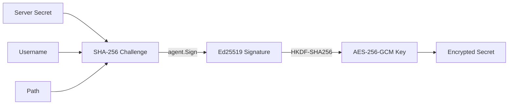
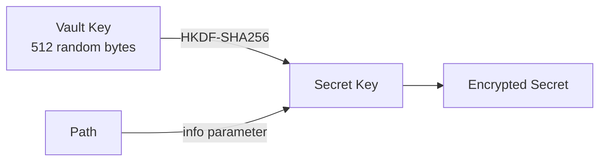
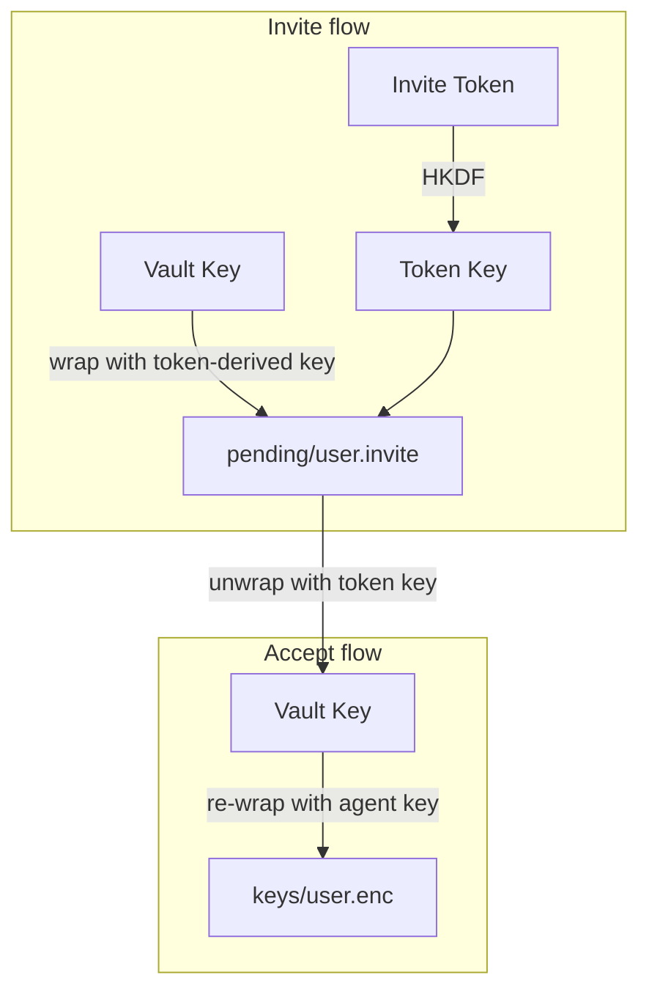

# Encryption

Keyhole encrypts all secrets at rest using AES-256-GCM. Encryption keys are derived differently for personal secrets and vault secrets.

## Personal secrets

Each personal secret gets its own encryption key, derived from your SSH agent signature:

```go
challenge  = SHA-256(server_secret + ":" + "keyhole-v1:" + username + ":" + path)
signature  = agent.Sign(your_ed25519_key, challenge)
key        = HKDF-SHA256(signature, info="keyhole-key-v1")
on-disk    = AES-256-GCM(key, nonce=random_12_bytes, plaintext)
```



Decrypting requires both your SSH private key (via agent) and the server secret. Neither is sufficient alone.

## Vault secrets

Vaults use a random 512-byte vault key shared among members. Each secret derives its own key from the vault key:

```go
secret_key = HKDF-SHA256(vault_key, info="keyhole-vault-v1:<path>")
on-disk    = AES-256-GCM(secret_key, nonce=random_12_bytes, plaintext)
```



## Vault key wrapping

Each member's copy of the vault key is wrapped with a key derived from their SSH agent signature:



This two-phase invite design means:

1. **Invite**: the vault key is wrapped with an HKDF-derived key from the invite token
2. **Accept**: the user decrypts with the token, then re-wraps the vault key with their agent-derived key

Revoking a member removes their wrapped key — no vault secrets need to be re-encrypted.
